# Curvas de comportamiento de COVID 19


[repositorio de github](https://github.com/rorode8/SIR-covid)


El comportamiento de epidemias puede ser simulado con modelos matemáticos o modelos estadísticos. En este estudio nos concentraremos en los modelos matemáticos. Específicamente usaremos un modelo **compartimental**. Los modelos de este tipo simplifican el problema al dividir la población total en compartimentos, asumiendo que cada individuo en un mismo compartimento tiene las mismas características.


  
# Objetivo


Desarrollar diferentes modelos matematicos por medio de ODEs que nos permitan entender distintos aspectos de la pandemia, tales como medir la velocidad de propagación de los contagios, establecer el rol de algunos mecanismos en el proceso de propagación, evaluar medidas de mitigación y contención, hacer estimaciones de la capacidad hospitalaria, etc.


# Requisitos


Para simular el comportamiento de la epidemia usaremos el modelo **SIR **(**S**usceptible **I**nfectious **R**emoved)[1]. El modelo consiste de al menos tres compartimiendos


   -  **S**: Personas susceptibles. Estos se pueden pasar al grupo de **I**nfectados al tener contacto con uno de ellos. 
   -  **I**: Personas infectadas. Aquellos que son portadores de la enfermedad. 
   -  **R**: Personas con inmunidad o que murieron. Este grupo puede ser interpretado de varias formas, pero son aquellas que fueron infectadas y ya no pertenecen a ese grupo. 


Cabe mencionar que este modelo, a pesar de ser muy usado en epidemiología, es muy básico porque no considera nacimientos o muertes en el análisis, tampoco la edad de las personas o la situación o estructura social en la que se encuentran. 


Al final compararemos nuestras gráficas de variables continuas contra las variables discretas y veremos que similitudes y diferencias se crean entre la realidad y este modelo matemático simple.


Para considerarse exitoso el modelo deberá asimilar los datos reales en al menos un escenario con datos previos contra los que se le compare.


# Creación del modelo
  
### Modelo SIR


Usaremos el modelo **SIR** de acuerdo al siguiente sistema de ecuaciones:


Aquí  representa la cantidad de personas que es contagiada, es decir, los que pasan de ser susceptibles a ser contagiados (infectados). Es por esto que la constante  (beta) representa la taza de infección. Se sabe que unas cepas de covid son más infecciosas que otras.


De la misma forma  representa la perdida de inmunidad. Por eso  representa a aquellos que pasan del compartimiento de removed, a ser susceptibles otra vez, es decir que pueden volverse a infectar.


Por último (gamma) representa la taza de recuperación.


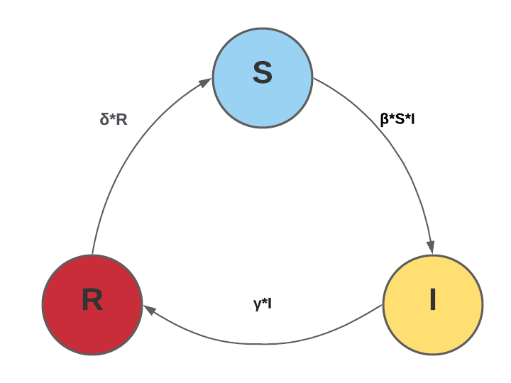


    **Figura 1: **Diagrama de flujo del modelo SIR


  
### Modelo SIRD


Podemos agregar más variantes al modelo base **SIR **para hacerlo más interesante y realista. En este caso agregamos un compartimiento extra para los decesos. De esta forma, solo pasarán a **R** los recuperados y los muertos se pasaran al nuevo compartimento **D**


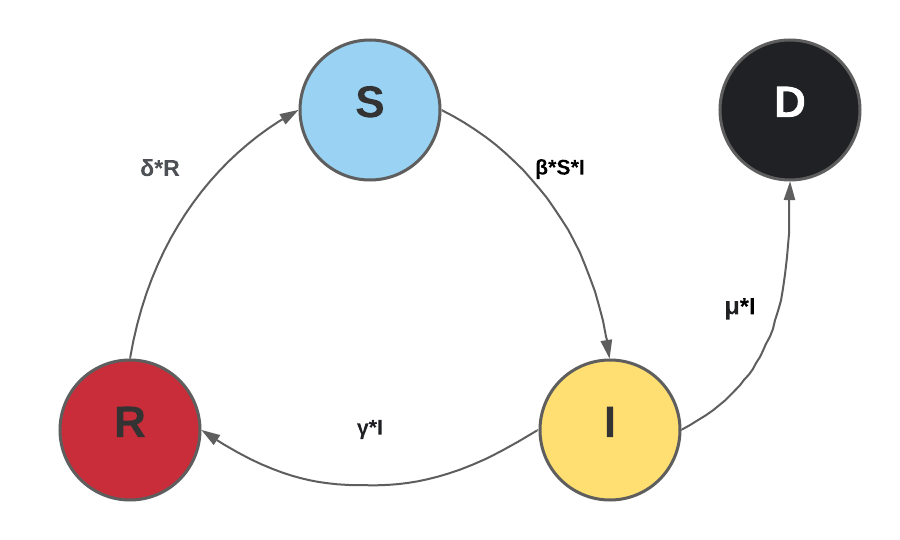


**    Figura 2: **Diagrama de flujo del modelo SIRD** **


  


Nuestro nuevo sistema de ecuaciones se ve de la siguiente manera.


# Implementación


Antes de implementar el modelo es importante mencionar las razones por las que el modelo no verá como una curva real de covid con varios repuntes. Los coeficientes usados aquí son promedios obtenidos de los datos de [owid](https://covid.ourworldindata.org/data/owid-covid-data.csv) para el reino Unido (UK). Esto causa que no se tome en cuenta las diferentes medidas tomadas por el gobierno para controlar en cierto espacio de tiempo, solo refleja como se comporta en promedio.


Para la taza de perdida de inmunidad no existen los datos para calcularlo en para un país en específico, así que usaremos un valor promedio usado en [otros estudios](https://www.ncbi.nlm.nih.gov/pmc/articles/PMC7598795/).


  

```matlab:Code
% Model parameters for the UK
beta = 9.6905E-09; % rate of infection
gamma = 0.532271959; % rate of recovery 
delta = 1/60; % rate of immunity loss 100 days
mu = 0.085470461; % fatallity rate
N = 66650000; % Total UK population 
I0 = 10; % initial number of infected
T =  500; % period of 300 days
dt = 1/4; % time interval of 6 hours (1/4 of a day)
fprintf('Reproduction Rate R0 is %.2f',N*beta/gamma)
```


```text:Output
Reproduction Rate R0 is 1.21
```


```matlab:Code
[t,S,I,R,D] = modelSIRD(beta,gamma,delta,mu,N,I0,T,dt);
```

# Pruebas y resultados

```matlab:Code
semilogy(t,[S,I,R,D])
hold on
%plot(t,I); 
%plot(t,R); 
%plot(t,D); 

%grid on;
xlabel('Days'); 
ylabel('Number of individuals');
legend('S','I','R','D','Location','southeast');
hold off
```


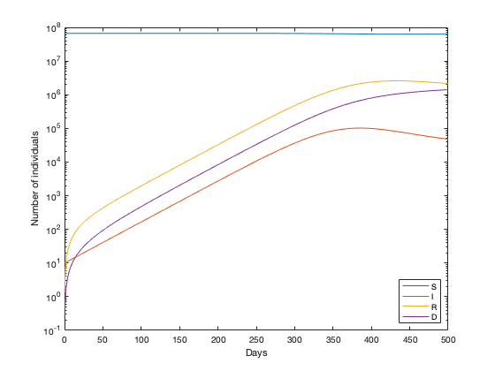


```matlab:Code

[v,i]=max(I);
d=i/4;
fprintf('El pico de casos activos es de %d y sucede %d dias después de que empezó la pandemia',round(v),round(d))
```


```text:Output
El pico de casos activos es de 101819 y sucede 386 dias después de que empezó la pandemia
```


```matlab:Code
[v,i]=max(D);
d=i/4;
fprintf('El total de muertes son %d al día %d desde que empezó la pandemia',round(v),round(d))
```


```text:Output
El total de muertes son 1412387 al día 500 desde que empezó la pandemia
```


La gráfica que resulta del modelo SIRD puede no distanciar mucho de la gráfica real por las limitaciones que mencionamos antes. Es importante ver que el modelo solo nos muestra el rol que juega cada variable dentro de una determinada población. En el caso del Reino unido, la tasa de mortalidad varia desde 2% hasta 14% dependiendo de la fecha.


# Comparación datos reales


Comparemos la acumulación de muertes de nuestra predicción contra la realidad https://coronavirus.data.gov.uk/details/download


```matlab:Code
data= readtable('UK-cum-death.csv');
data([end-499:end],[2,4,5])
```

| |areaName|date|cumDailyNsoDeathsByDeathDate|
|:--:|:--:|:--:|:--:|
|1|'United Kingdom'|06/12/2021|153753|
|2|'United Kingdom'|06/11/2021|153742|
|3|'United Kingdom'|06/10/2021|153729|
|4|'United Kingdom'|06/09/2021|153714|
|5|'United Kingdom'|06/08/2021|153698|
|6|'United Kingdom'|06/07/2021|153683|
|7|'United Kingdom'|06/06/2021|153677|
|8|'United Kingdom'|06/05/2021|153664|
|9|'United Kingdom'|06/04/2021|153658|
|10|'United Kingdom'|06/03/2021|153646|
|11|'United Kingdom'|06/02/2021|153631|
|12|'United Kingdom'|06/01/2021|153619|
|13|'United Kingdom'|05/31/2021|153609|
|14|'United Kingdom'|05/30/2021|153598|


```matlab:Code
column1 = table2cell(data(end-499:end,5)); %500 dias
deaths = cell2mat(column1);
days = 500:-1:1;
semilogy(days,deaths,"r o")
hold on
semilogy(t,D,"k")
xline(346,"--");
legend("predicted","real","346 days of provided data","Location","best")
hold off
```


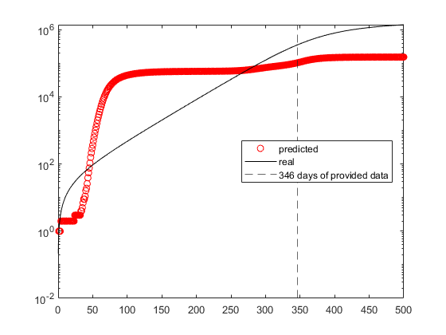


Como podía esperarse, al tomar una muestra tan grande de datos como lo son 346 dias y simplemente promedias las tasas de cambio incurrimos en un error bastante grande.


Este **no** modelo cumple todos los requisitos formulados previamente ya que:


   -  el modelo tiene demasiado error y no se asemeja a la curva de los datos reales 

## CASO ITALIA SIRD SIMPLE


El siguiente script usa datos del 1 de agosto de 2021 a 1 de noviembre de 2021 de Italia, recolectados igualmente del OWID.


```matlab:Code
% ITALY
% Model parameters for the UK
beta = 1.65869E-09; % rate of infection
%no mask
%beta = beta*1.1;

gamma = 0.076163777; % rate of recovery 
delta = 1/60; % rate of immunity loss 100 days
mu = 0.001166467; % fatallity rate
N = 66650000 % Total UK population N = S + I + R
```


```text:Output
N = 66650000
```


```matlab:Code
I0 = 6714; % initial number of infected = [diferencia de casos en 30 dias - (diferencia decesos en 30 dias)]
T =  180; % period of 300 days
dt = 1/12; % time interval of 6 hours (1/4 of a day)
D0=35146;
%R0=281707
R0=160686
```


```text:Output
R0 = 160686
```


```matlab:Code
fprintf('Value of parameter R0 is %.2f',N*beta/gamma)
```


```text:Output
Value of parameter R0 is 1.45
```


```matlab:Code

[t,S,I,R,D] = modelSIRD2(beta,gamma,delta,mu,N,I0,T,dt,R0,D0);
semilogy(t,[S,I,R,D])
legend('S','I','R','D','Location','best');
title("180 days italy prediction")
```


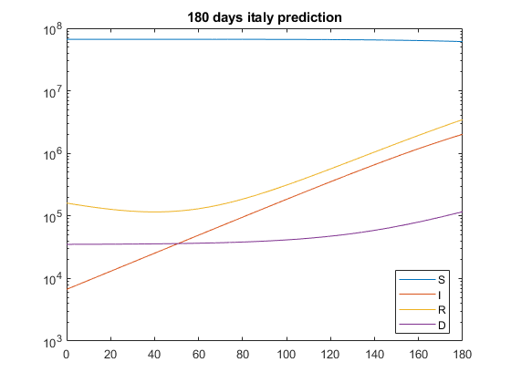


```matlab:Code
[v,i]=max(D);
d=i/12;
fprintf('El total de muertes son %d al día %d desde que empezó la pandemia \n',round(v),round(d))
```


```text:Output
El total de muertes son 116827 al día 180 desde que empezó la pandemia 
```


```matlab:Code
data = csvread('ITA-CUM-death.csv');
column1 = data(:,1);
days = 1:length(column1);
plot(t,D, "k","LineWidth",2)
hold on
plot(days,column1,"r o")
xline(90,"k--","data provided till day 90")
grid on
hold off
legend("predicted","real")
xlabel('Days since august 1st 2020'); 
ylabel("Death toll")
```


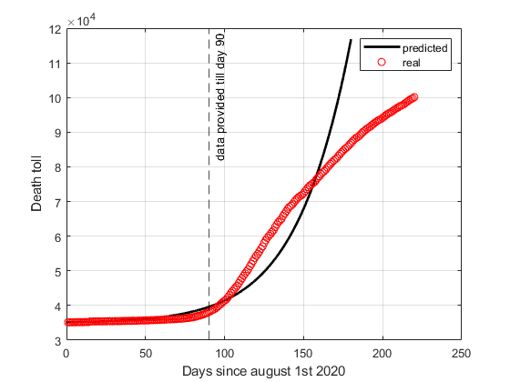


Podemos ver cómo el modelo emula mejor el comportamiento de las muertes acomuladas reales, sin embargo, las autoridades en italia tomaron [medidas preventivas para reducir los contagios y las muertes](https://www.garda.com/crisis24/news-alerts/367781/italy-authorities-extend-covid-19-restrictions-until-september-7-update-38). 


Este modelo cumple todos los requisitos formulados previamente ya que:


   -  es un modelo matematico de ODEs 
   -  su comportamiento es parecido a los datos reales 
   -  los datos usados para calcular los coeficientes solo son de 90 días 

  
## CASO ITALIA SIRD AVANZADO [2]


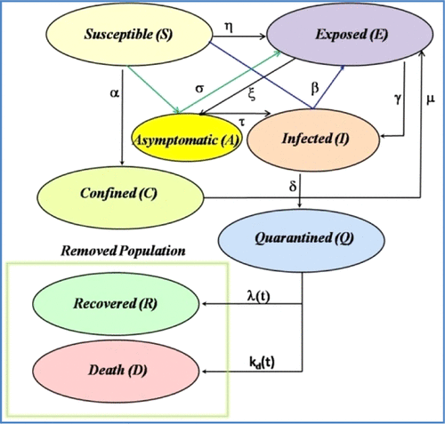


    **Figura 3: **Diagrama SIRD avanzado


```matlab:Code
%italy
N = 6.046*10^7;
alpha = 0.0194;
beta=7.567;
mu=2.278 * 10^-6;
nao=9.180  * 10^-7;
sigma=1.463^-3;
tao=1.109  * 10^-4;
epsilon=0.263;
gamma=0.021;
delta=	0.077;
lambda0 = 	0.157;
lambda1 = 0.025;
k0 = 0.779;
k1 = 0.061;
x0=0;
T = 180;
dt = 1/4; 
y0= [N; 1; 0; 1; 1; 0; 1; 0];
[t,S, A, C, E, I, R, Q, D] = modelSIRDAvanzado(alpha,beta,mu,nao,sigma,tao,epsilon,gamma,delta,lambda0,lambda1,k0,k1,N,y0,x0,dt,T);
plot(t,[S I R D])
legend('S','I','R','D')
```


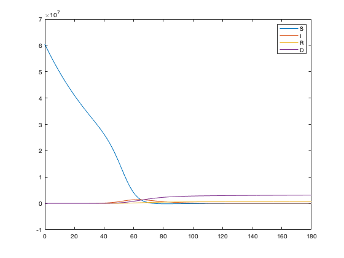


```matlab:Code

%data = csvread('ITA-CUM-death-day0-180.csv');
T = readtable('ITA-CUM-death-day0-180.csv');
column1 = T{:,1};

%column1 = data(:,1);
days = 1:length(column1);
semilogy(t,D, "k","LineWidth",2)
hold on
semilogy(days,column1,"r o")
%grid on
hold off
title("Muertes en Italia desde el inicio de la pandemia")
legend("predicted","real",'Location','southeast')
xlabel('Days'); 
ylabel("Death toll");
```


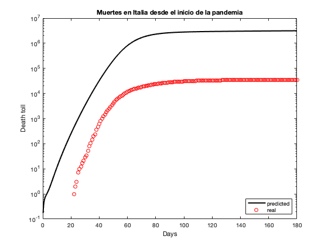


Aunque los números de la predicción son mayores, el comportamiento es parecido, ambas gráficas se empiezan a aplanar a los 40-60 días.


Este modelo con estos datos en particular **no **cumple con los requisitos definidos ya que los números no son realistas. 


## Entendiendo la importancia de los coeficientes


Revisitemos el caso del Reino Unido con el modelo SIRD simple para observar incrementos en las variables de taza de infección (beta) y taza de recuperación (gamma).


```matlab:Code
% Model parameters for the UK
beta = 9.6905E-09; % rate of infection
gamma = 0.532271959; % rate of recovery 
delta = 1/60; % rate of immunity loss 100 days
mu = 0.085470461; % fatallity rate
N = 66650000; % Total UK population 
I0 = 10; % initial number of infected
T =  500; % period of 300 days
dt = 1/4; % time interval of 6 hours (1/4 of a day)
[t,S,I,R,D] = modelSIRD(beta,gamma,delta,mu,N,I0,T,dt);
```

### BETA


Los datos tomados para este estudio son los promedios de esas variables desde que empezó el 1 de febrero de 2020 hasta el pico de casos el 9 de enero de 2021. Para estas ultimas fechas el proceso de vacunación (que empezó en diciembre 13 de 2020) juega un papel importante en reducir el número de decesos y contagios.


Veamos ahora que pasa si se relajan las medidas preventivas, es decir un aumento en el coeficiente de infección **beta**


```matlab:Code

betaBase = beta
```


```text:Output
betaBase = 9.6905e-09
```


```matlab:Code
for i = 1.1:0.1:1.5
    figure;
    beta = betaBase * i
    
    [t,S,I,R,D] = modelSIRD(beta,gamma,delta,mu,N,I0,T,dt);
    semilogy(t,[S,I,R,D])    
    
    hold on
    title("SIRD con beta al "+i*100+" %")
    xlabel('Days'); 
    ylabel('Number of individuals');
    legend('S','I','R','D','Location','southeast');
    hold off
    [v,i]=max(D);
    d=i/4;
    fprintf('Value of parameter R (Reproduction rate) is %.2f',N*beta/gamma)
    fprintf('El total de muertes son %d al día %d desde que empezó la pandemia \n',round(v),round(d))
end
```


```text:Output
beta = 1.0660e-08
```


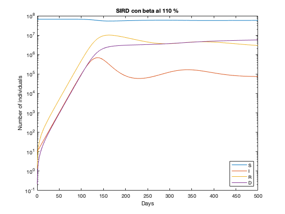


```text:Output
Value of parameter R (Reproduction rate) is 1.33
El total de muertes son 5716279 al día 500 desde que empezó la pandemia 
beta = 1.1629e-08
```


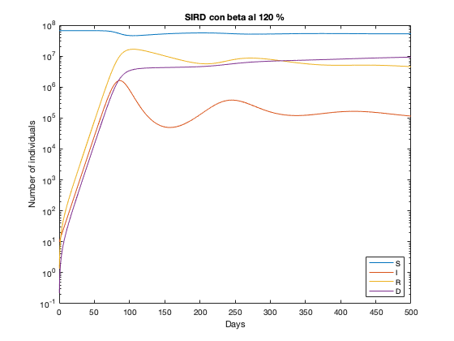


```text:Output
Value of parameter R (Reproduction rate) is 1.46
El total de muertes son 9269041 al día 500 desde que empezó la pandemia 
beta = 1.2598e-08
```


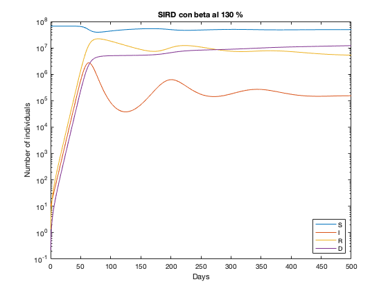


```text:Output
Value of parameter R (Reproduction rate) is 1.58
El total de muertes son 12173548 al día 500 desde que empezó la pandemia 
beta = 1.3567e-08
```


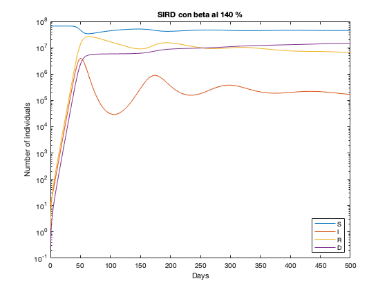


```text:Output
Value of parameter R (Reproduction rate) is 1.70
El total de muertes son 14777172 al día 500 desde que empezó la pandemia 
beta = 1.4536e-08
```


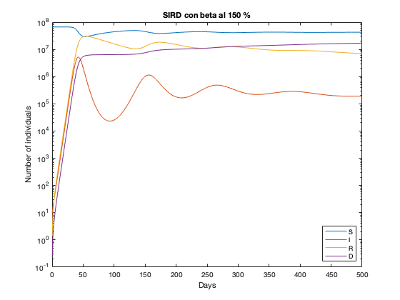


```text:Output
Value of parameter R (Reproduction rate) is 1.82
El total de muertes son 16935175 al día 500 desde que empezó la pandemia 
```


Podemos ver cómo un incremento de apenas el 10% resulta en un gran incremento de decesos. En un escenario real, incrementaría a la vez la tasa de mortalidad y decrementaría por lo tanto la tasa de recuperación. Esto debido al sobrecupo de los hospitales.


### GAMMA

\hfill \break


```matlab:Code
beta = betaBase;
gammaBase = gamma;
for gamma = gammaBase:-0.11:gammaBase-0.11*4
    figure;
    
    [t,S,I,R,D] = modelSIRD(beta,gamma,delta,mu,N,I0,T,dt);
    semilogy(t,[S,I,R,D])    
    
    hold on
    title("SIRD con gamma = "+gamma)
    xlabel('Days'); 
    ylabel('Number of individuals');
    legend('S','I','R','D','Location','best');
    hold off
    [v,i]=max(D);
    d=i/4;
    fprintf('Value of parameter R (Reproduction rate) is %.2f',N*beta/gamma)
    fprintf('El total de muertes son %d al día %d desde que empezó la pandemia \n',round(v),round(d))
end
```


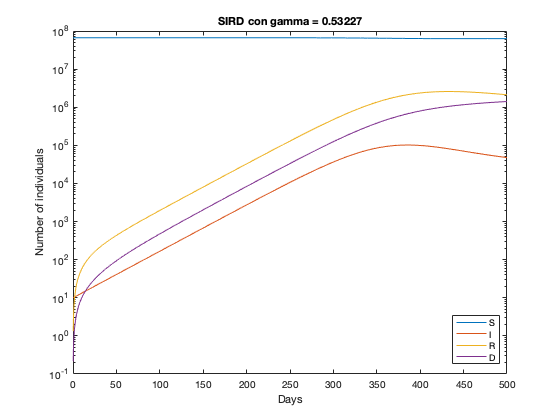


```text:Output
Value of parameter R (Reproduction rate) is 1.21
El total de muertes son 1412387 al día 500 desde que empezó la pandemia 
```


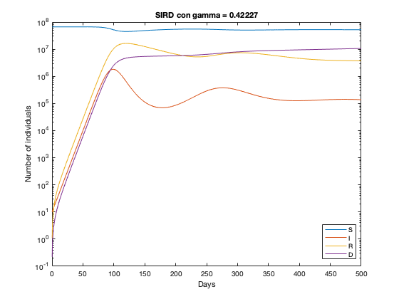


```text:Output
Value of parameter R (Reproduction rate) is 1.53
El total de muertes son 10638058 al día 500 desde que empezó la pandemia 
```


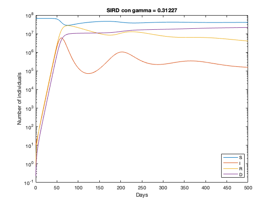


```text:Output
Value of parameter R (Reproduction rate) is 2.07
El total de muertes son 21657465 al día 500 desde que empezó la pandemia 
```


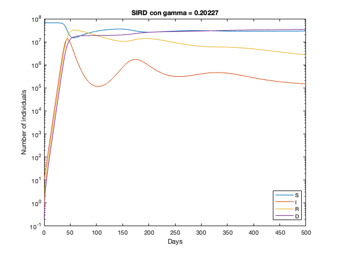


```text:Output
Value of parameter R (Reproduction rate) is 3.19
El total de muertes son 34454982 al día 500 desde que empezó la pandemia 
```


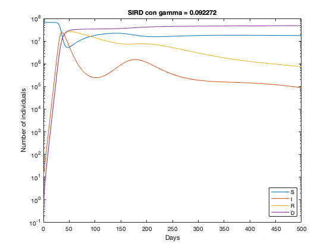


```text:Output
Value of parameter R (Reproduction rate) is 7.00
El total de muertes son 48173566 al día 500 desde que empezó la pandemia 
```

# Conclusión


Entender este comportamiento de la pandemia causada por la enfermedad coronavirus nos permite ver las medidas sanitarias necesarias, estructurar medidas de mitigación y contención, hacer estimaciones de la capacidad hospitalaria, entre otros. Esto se debe a que en los modelos matemáticos usados podemos interactuar con las variables y así tratar de predecir el comportamiento de varios aspectos de la pandemia. En este caso es más fácil describir las variables por cómo cambian en lugar de por lo que representan. Es por esto que estos sistemas físicos son sistemas de ecuaciones diferenciales.


Como vimos en el caso de Inglaterra, al usar un promedio de un año para los datos, el modelo distancia mucho de la realidad. A pesar de necesitar menos datos que los modelos estadísticos, los modelos de ecuaciones diferenciales ordinarias (como es el SIRD) dependen grandemente de los coeficientes.


En el primer caso de Italia con SIRD simple obtuvimos buenos resultados. Esto se debe a que los coeficientes tienen sentido para este marco de tiempo. Podriamos probablemente recortar los datos a tan solo 14 dias y obtener una buena simulación de los siguientes 30 días si la situación no cambia. Es aquí donde vemos cómo estos modelos nos muestran un escenario realista o muy aproximado a la realidad. De esta forma, podemos reaccionar proactivamente antes de una catastrofe.


El último modelo está hecho para verse de una forma retrospectiva, difícilmente podremos calcular todos los coeficientes de forma previa. Pero podemos calcular diferentes escenarios jugando con estos coeficientes y ver la severidad de estos casos hipoteticos.


Finalmente, observamos como solo el SIRD simple de Italia cumple con todos los requisitos. Al contrario del SIRD avanzado. Esto nos muestra como los sistemas más complejos son muy delicados en cuanto a la exactitud de los párametros (coeficientes) que se usan en el modelo. El modelo y su efectividad dependen más fuertemente de estos coeficientes que de su complejidad misma. 


# Referencias


[1] R. Beckley, C.Weatherspoon, M. Alexander , M. Chandler, A.Johnson , and G. S. Bhatt."Modeling epidemics with differential equations". Tennessee State University. [[link]](https://www.tnstate.edu/mathematics/mathreu/filesreu/GroupProjectSIR.pdf). visitado 5/7/2021


[2] [Ind. Eng. Chem. Res. 2021, 60, 11, 4251–4260](https://pubs.acs.org/doi/10.1021/acs.iecr.0c04754)


# Funciones

```matlab:Code
function [t,S,I,R] = modelSIR(beta,gamma,delta,N,I0,T,dt)
    [t,y] = runKut4(@(t,y) SIRfunc(t,y,beta,gamma,delta),0,dt,T,[N-I0;I0;0]);    
    S=y(:,1);
    I=y(:,2);
    R=y(:,3);
end

function [t,S,I,R,D] = modelSIRD(beta,gamma,delta,mu,N,I0,T,dt)
    [t,y] = runKut4(@(t,y) SIRDfunc(t,y,beta,gamma,delta,mu,N),0,dt,T,[N-I0;I0;0;0]);  
    S=y(:,1);
    I=y(:,2);
    R=y(:,3);
    D=y(:,4);
end

function [t,S,I,R,D] = modelSIRD2(beta,gamma,delta,mu,N,I0,T,dt,R0,D0)
    [t,y] = runKut4(@(t,y) SIRDfunc(t,y,beta,gamma,delta,mu,N),0,dt,T,[N-I0;I0;R0;D0]);  
    S=y(:,1);
    I=y(:,2);
    R=y(:,3);
    D=y(:,4);
end

function [t,S, A, C, E, I, R, Q, D] = modelSIRDAvanzado(alpha,beta,mu,nao,sigma,tao,epsilon,gamma,delta,lambda0,lambda1,k0,k1,N,y0,x0,dt,T)
    
    [t,y] = ode45(@(t,y) SIRDAfunct(t,y,alpha,beta,mu,nao,sigma,tao,epsilon,gamma,delta,lambda0,lambda1,k0,k1,T,N),x0:dt:T,y0);
    
    S=y(:,1);
    A=y(:,2);
    C=y(:,3);
    E=y(:,4);
    I=y(:,5);
    R=y(:,6);
    Q=y(:,7);
    D=y(:,8);
    
end

function [xSol,ySol] = runKut4(F,x0,h,xStop,y0)
    
    reshape( y0, [],1 ); % column vector
    xSol = zeros(2,1); 
    ySol = zeros(length(y0),2);
    xSol(1) = x0; 
    ySol(:,1) = y0;
    i = 1;
    x=x0;
    y=y0;    
    while x < xStop
        i = i + 1;
        h = min(h,xStop - x);
        K1 = h*F(x,y);
        K2 = h*F(x + h/2,y + K1/2);
        K3 = h*F(x + h/2,y + K2/2);
        K4 = h*F(x+h,y + K3);
        y = y + (K1 + 2*K2 + 2*K3 + K4)/6;
        x = x + h;
        xSol(i) = x;
        ySol(:,i) = y; 
    end
    
    xSol = xSol';
    ySol=ySol';
end

function dydt = SIRfunc(t,y,beta,gamma,delta)
    dydt = zeros(3,1);
    %dydt(1)=dS
    %dydt(2)=dI
    %dydt(3)=dR
    dydt(1) = (-beta.*y(2).*y(1) + delta.*y(3));    
    dydt(2) = (beta.*y(2).*y(1) - gamma.*y(2));
    dydt(3) = (gamma.*y(2) - delta.*y(3));
end

function dydt = SIRDfunc(t,y,beta,gamma,delta,mu,N)
    dydt = zeros(4,1);
    %dydt(1)=dS
    %dydt(2)=dI
    %dydt(3)=dR
    dydt(1) = (-beta.*y(2).*y(1) + delta.*y(3));
    dydt(2) = (beta.*y(2).*y(1) - gamma.*y(2) -mu.*y(2));
    dydt(3) = (gamma.*y(2) - delta.*y(3));
    dydt(4) = mu.*y(2);
end

function dydt = SIRDAfunct(t,y,alpha,beta,mu,nao,sigma,tao,epsilon,gamma,delta,lambda0,lambda1,k0,k1,tf,N)
    dydt = zeros(8,1);
    %S=1, A=2, C=3, E=4, I=5, R=6, Q=7, D=8
    
    dydt(1) = -alpha*y(1) - beta*y(5)*y(6)./N - sigma*y(1)*y(2)./N -nao*y(1); %dS
    dydt(2) = - tao*y(2) + epsilon*y(4); %dA
    dydt(3) = (alpha*y(1)./N) -mu*y(3); %dC
    dydt(4) = -gamma*y(4) +beta*y(5)*y(1)./N +mu*y(3)+nao*y(1) +sigma*y(1)*y(2)./N -epsilon*y(4); %dE
    dydt(5) = tao*y(2)+gamma*y(4)-delta*y(5); %dI
    dydt(6) = (lambda0 + (t/tf)*(lambda1-lambda0))*y(7); %dR
    dydt(7) = delta*y(5)-((lambda0 + (t/tf)*(lambda1-lambda0))*y(7)) -((k0 + (t/tf)*(k1-k0))*y(7)); %dQ
    dydt(8) = (k0 + (t/tf)*(k1-k0))*y(7); %dD

end

```

